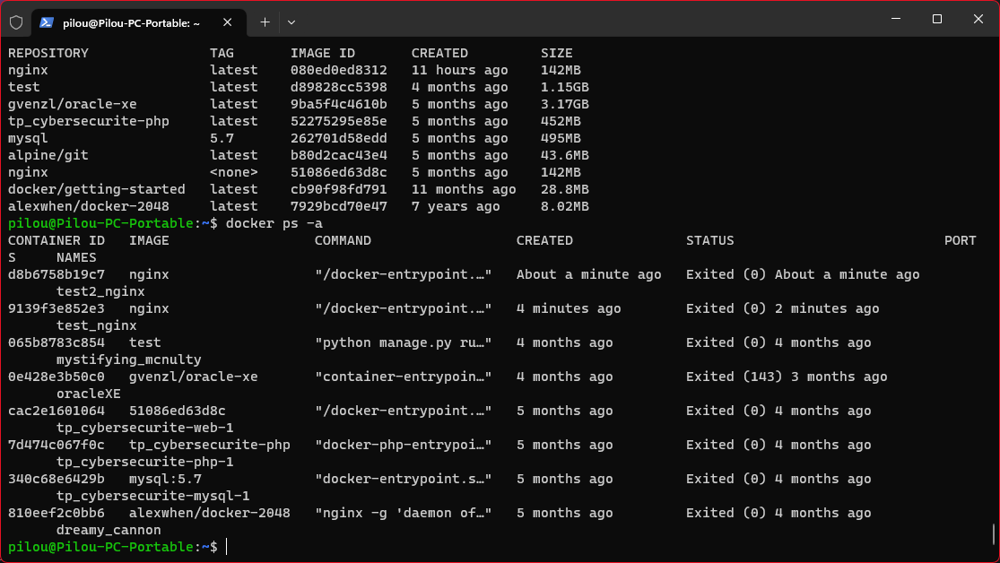
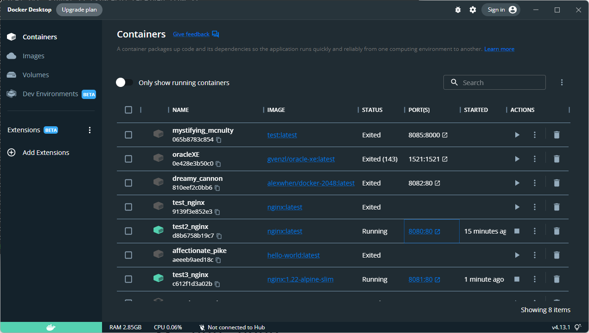

- Creation image docker nginx
- 
-
- Creation de plusieurs containers avec plusieurs versions de de nginx
- 
- Avec ces commandes :
	- docker run -p 8080:80 --name "test2_nginx" nginx
	- docker run -p 8081:80 --name "test3_nginx" nginx:1.22-alpine-slim
-