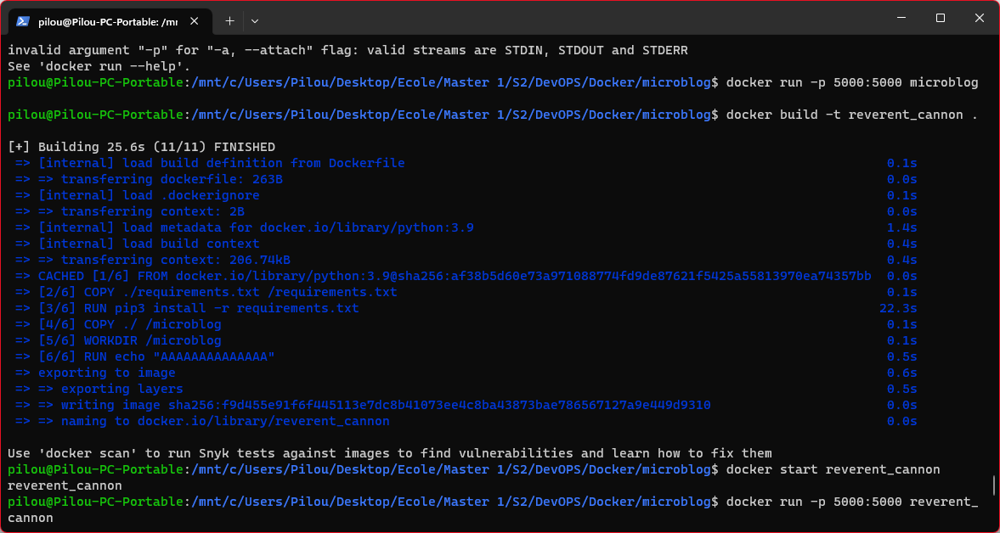
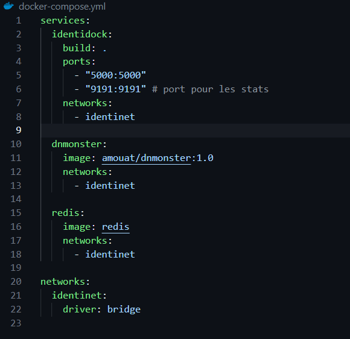

- # Suivi du TP2
- https://supports.uptime-formation.fr/04-docker/2-tp_les-dockerfiles/
	- `docker build -t microblog .`
	- `docker run -p 5000:5000 microblog`
	- `docker build -t <nom_de_l'image> .`
	- 
	- # Dockerfile
		- `FROM python:3.9`
		- `COPY ./requirements.txt /requirements.txt`
		- `RUN pip3 install -r requirements.txt`
		- `ENV FLASK_APP microblog.py`
		- `COPY ./ /microblog`
		- `WORKDIR /microblog`
		- `CMD ["./boot.sh"]`
-
- # Suivi du TP4
- https://supports.uptime-formation.fr/04-docker/4-tp_docker-compose/
	- # Dockerfile
		- `FROM python:3.7`
		- `RUN groupadd -r uwsgi && useradd -r -g uwsgi uwsgi`
		  `RUN pip install Flask uWSGI requests redis`
		- `WORKDIR /app`
		- `COPY app/identidock.py /app`
		- `EXPOSE 5000 9191`
		- `USER uwsgi`
		- `CMD ["uwsgi", "--http", "0.0.0.0:5000", "--wsgi-file", "/app/identidock.py", \`
		- `"--callable", "app", "--stats", "0.0.0.0:9191"]`
-
	- # Docker Compose
		- 
		- Avec la commande :
		- `docker compose up`